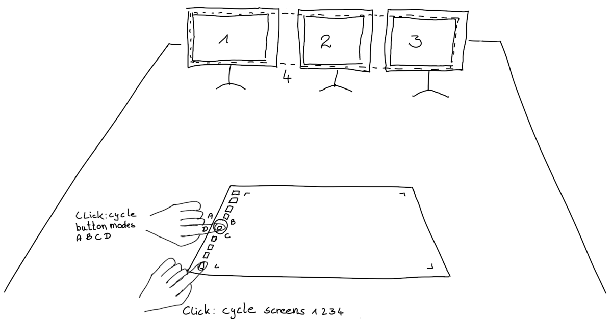

# Yet another Wacom Tool

Since the Wacom configuration UIs in KDE Plasma and Gnome 2/3 are very limiting and provide only poor configuration ability, this tool allows achieving a Wacom board configuration beyond those
limitations. It is based on `xsetwacom` and `XBindKeys`.

**Noteworthy features:**

- cycle in-between screens
- auto adjust Wacom input area to preserve the `width:height` ratio on the output display
- button events can be mapped to:
  - hot-keys (several keys pressed at once)
  - key sequence (to reset zoom and rotation in Krita: first press `5`, then release, then press `2`, then release)
  - scripts, commands
- multiple configuration profiles
- supports different models (not limited to Intuos Pro)
- plot current pen or eraser pressure as a live plot

## Examples



```bash
# In most cases, if the configuration is set up correctly, this is enough:
$ ./xsetwacom.py --config <your_config> bindkeys --start
# The script starts xbindkeys which in turn will react on button events and trigger actions, i.e:
# - cycle screens (button and behaviour depends on configuration), 
# - cycle button modes (button and behaviour depends on configuration). 

```

```bash
# A one time configuration loads the configuration and sends parameters to the device accordingly:
$ ./xsetwacom.py --config <your_config> device --set
# If cycling through screens or button modes is not required this command is enough.
```

## Synopsis

```bash
$ ./xsetwacom.py --help
usage: xsetwacom.py [-h] [-c {krita_intuos_pro}] {device,bindkeys,config,plot} ...

options:
  -h, --help            show this help message and exit

command (required):
  Run command with the loaded configuration.

  {device,bindkeys,config,plot}
    device              detect devices; set and get device parameter
    bindkeys            bind device-key events to system mouse/keyboard events
    config              print known configurations or configuration values
    plot                Visualize pressure curve or current pressure.

Configuration:
  Load and provide the configuration to the command.

  -c {krita_intuos_pro}, --config {krita_intuos_pro}
                        Loads the given configuration by name. (default: krita_intuos_pro)
```

## Requirements

- Python 3 - mandatory
- `xsetwacom` - mandatory
- `xrandr` - mandatory
- `xbindkeys` - optional but highly recommended; required by `bindkeys` sub-command

## Aims and Non Aims

✓ simple \
✓ painless setup \
✓ allow sophisticated configuration \
✗ no GUI, only CLI ✗ no auto configuration

## Limitations

✗ X11 only, no Wayland support \
✗ no Gnome Shell support (github.com/linuxwacom/xf86-input-wacom/issues/289)

# Device Notes

## Intuos Pro L

This device broadcasts two Bluetooth beacons. Both connections need to be paired 'LE Intuous Pro L' and 'BT Intuous Pro L'. In case of frequent disconnects or no battery level being reported remove
both paired connections and pair the deivce again. First pair the LE then the BT connection. Once paired, connecting only to BT is sufficient.

1. long press on touch circle button -> pair the LE connection, then
2. long press on touch circle button -> pair the BT connection

## Intuos BT M

This device can be connected in three ways:

1. by Bletooth (LED lights blue)
2. by USB in Desktop Mode (LED lights bright white)
3. by USB in Mobile Mode (LED lights dim white)

If the device is connected by USB, the Intuos BT M needs to be switched to Descktop Mode, by bluetooth it works out of the box.

To switch in between both USB modes press the **leftmost + rightmost buttons simultaneously** for about four seconds until the white LED goes off. For this step the USB cable must be connected.
Unfortunately this step is poorly propagated and the last mode is not preserved or the mode is not detected correctly.
See: https://github.com/linuxwacom/xf86-input-wacom/wiki/Known-Issues#android-misdetect

Device detected if connected by ...

1. Bluetooth
   ```bash
   $ xsetwacom --list
   Wacom Intuos BT M Pad pad               id: 10  type: PAD
   Wacom Intuos BT M Pen stylus            id: 11  type: STYLUS
   ```
2. USB - Mobile Mode (default)
   ```bash
    $ xsetwacom --list
    Wacom Co.,Ltd. Intuos BT M stylus       id: 10  type: STYLUS
    Wacom Co.,Ltd. Intuos BT M eraser       id: 11  type: ERASER
   ```

3. USB - Desktop Mode (recommended)
   ```bash
    $ xsetwacom --list
    Wacom Intuos BT M Pad pad               id: 10  type: PAD
    Wacom Intuos BT M Pen stylus            id: 11  type: STYLUS
    Wacom Intuos BT M Pen eraser            id: 17  type: ERASER
    Wacom Intuos BT M Pen cursor            id: 18  type: CURSOR
   ```
