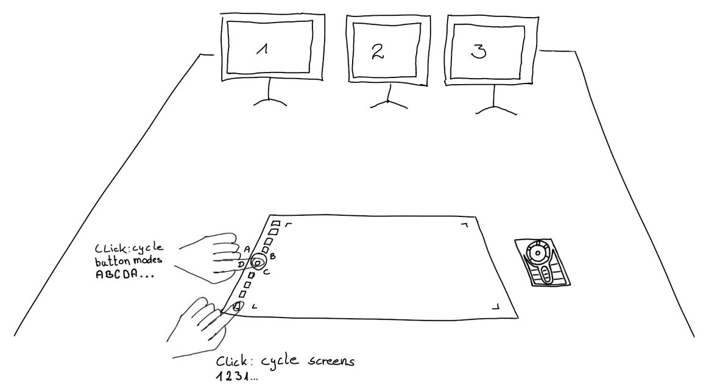

# Yet another Wacom Tool

This tool enables Wacom configuration beyond the limitation built-in configuration UIs of `KDE Plasma`, `Gnome 2/3` or similar.
It is based on `xsetwacom`, `XBindKeys`, `xinput` and `xrandr`.
It doesn't depend on a specific desktop environment but requires X11 (no Wayland).

At the time of writing this tool has no UI but covers the lack of fundamental features the built-in UIs cannot do:

1. any button can change behaviour depending on the ring-button LED (or faked LED for devices that have none)
2. button not only triggers hot-keys but can do also:
   1. key sequences
   2. scripts, commands

**Sample configurations are available for:**

- Express Key Remote Pad
- Cintiq
  - 21UX
  - 22HD
  - 22HDT
- Intuos
  - BT
  - Pro
    - PTH-651
    - PTH-680

**Noteworthy features:**

- cycle mapping in-between screens
- auto adjust input area to preserve the `width:height` ratio on the display
- modes: maps device button(s) (if any) according to the mode
  - LED-dependent mode: read the device LEDs (if any)
  - LED-independent mode(s): read mode state from persistence file (fake LED; user defined modes)
- button events can be mapped to:
  - hot-keys (several keys pressed at once)
  - key sequence (i.e. reset zoom and rotation in Krita: first press `5`, then release `5`, then press `2`, then release `2`)
  - scripts, commands
- multiple configuration profiles: different models, per application profile ...
- can handle multiple devices at the same time (i.e. Cintiq and Express Key remote)
- plot current pen or eraser pressure as a live plot

## Example: Intuos Pro L with three Displays



```bash
# In most cases, if the configuration is set up correctly, this is enough:
$ ./xsetwacom.py --config <your_config> bindkeys --start
# To initially configure the device press the wheel/mode button once.
# Some devices/configs require pressing the cycle-screen button first (i.e. Intuos Pro PTH-651)

# The script starts xbindkeys which in turn will react on button events and trigger actions, i.e:
# - cycle screens and
# - cycle ring-button modes (wheel button or any arbitrary button; reads LED or faked-LED state).

# Note: if the device is disconnected and re-attached, all buttons emit default events again. 
# For convenience, a configuration profiles shall (if possible) react on the default events of
# - the wheel/mode button and/or 
# - the screen-cycle button.
```

```bash
# To initially configure a device:
$ ./xsetwacom.py --config <your_config> device --set

# This is enough if the configuration is static: 
# - key binding with ´xbindkeys` is not required 
# - wheel LEDs/modes are irrelevant
# - cycling through screens is not needed

# This is required if your custom configuration does not trigger `xbindkeys` with the default button events.
# - Usually the wheel-button and/or the screen-cycle button should trigger `xbindkeys`.
```

## Synopsis

```bash
$ ./xsetwacom.py --help
usage: xsetwacom.py [-h]
                    [-c {krita_intuos_bt,blender_sculpting_intuos_pro,krita_intuos_pro,mypaint_intuos_bt}]
                    [-l {INFO,DEBUG}]
                    {device,bindkeys,mode,config,plot} ...

options:
  -h, --help            show this help message and exit

command (required):
  Run command with the loaded configuration.

  {device,bindkeys,mode,config,plot}
    device              detect devices; set and get device parameter
    bindkeys            bind device-key events to system mouse/keyboard events
    mode                manipulate device modes, i.e. for devices without LED indicators
    config              print known configurations or configuration values
    plot                Visualize pressure curve or current pressure.

Configuration:
  Load and provide the configuration to the command.

  -c {gimp_intuos_bt,krita_cintiq_22hdt,krita_intuos_bt,blender_sculpting_intuos_pro,krita_express_key_remote_pad,krita_intuos_pro,mypaint_intuos_bt,blender_2d_animation_intuos_pro}, --config {gimp_intuos_bt,krita_cintiq_22hdt,krita_intuos_bt,blender_sculpting_intuos_pro,krita_express_key_remote_pad,krita_intuos_pro,mypaint_intuos_bt,blender_2d_animation_intuos_pro}
                        Loads the given configuration by name. (default: krita_intuos_pro)

Logging:
  Manipulate the verbosity level.

  -l {INFO,DEBUG}, --log {INFO,DEBUG}
                        Set the logging level: lesser logs INFO, verbose DEBUG. (default: INFO)
```

## Requirements

| Dependency           | Mandatory             | Description                                                  | 
|----------------------|-----------------------|--------------------------------------------------------------|
| Python >= 3.10       | mandatory             | -                                                            |
| `xsetwacom`          | mandatory             | detect devices; read/write device parameters                 |
| `xrandr`             | optional, recommended | to compute geometry and clipping (keep `width:height` ratio) |
| `xbindkeys`          | optional              | only needed if commands shall be triggered on button press   |
| `xinput`             | optional              | to retrieve LED status: determine input device ID            |
| `killall` `ls` `cat` | optional              | retrieve LED device intensities                              |
| `pytest`             | optional              | for development                                              |
| `pylint`             | optional              | for development                                              |

## Aims and Non Aims

✓ simple to use \
✓ fast to apply once configuration is created \
✓ sophisticated configuration possible \
✗ no GUI, ✓ CLI only

## Limitations

✗ only X11, no Wayland \
✗ no Gnome-Shell support ([github.com/linuxwacom/xf86-input-wacom/issues/289](https://github.com/linuxwacom/xf86-input-wacom/issues/289))

# Device Notes

## Intuos Pro L

This device broadcasts two Bluetooth beacons. Both connections need to be paired 'LE Intuos Pro L' and 'BT Intuos Pro L'. In case of frequent disconnects or no battery level being reported remove both
paired connections and pair the device again. First pair the LE then the BT connection. Once paired, connecting only to BT is sufficient.

1. long press on touch circle button -> pair the LE connection, then
2. long press on touch circle button -> pair the BT connection

## Intuos BT M

This device can be connected in three ways:

1. by Bluetooth (LED lights blue)
2. by USB in Desktop Mode (LED lights bright white)
3. by USB in Mobile Mode (LED lights dim white)

If the device is connected by USB, the Intuos BT M needs to be switched to Desktop Mode, by bluetooth it works out of the box.

To switch in between both USB modes press the **leftmost + rightmost buttons simultaneously** for about four seconds until the white LED goes off. For this step the USB cable must be connected.
Unfortunately this step is poorly propagated and the last mode is not preserved or the mode is not detected correctly.
See: https://github.com/linuxwacom/xf86-input-wacom/wiki/Known-Issues#android-misdetect

Device detected if connected by ...

1. Bluetooth
   ```bash
   $ xsetwacom --list
   Wacom Intuos BT M Pad pad               id: 10  type: PAD
   Wacom Intuos BT M Pen stylus            id: 11  type: STYLUS
   ```
2. USB - Mobile Mode (default)
   ```bash
    $ xsetwacom --list
    Wacom Co.,Ltd. Intuos BT M stylus       id: 10  type: STYLUS
    Wacom Co.,Ltd. Intuos BT M eraser       id: 11  type: ERASER
   ```

3. USB - Desktop Mode (recommended)
   ```bash
    $ xsetwacom --list
    Wacom Intuos BT M Pad pad               id: 10  type: PAD
    Wacom Intuos BT M Pen stylus            id: 11  type: STYLUS
    Wacom Intuos BT M Pen eraser            id: 17  type: ERASER
    Wacom Intuos BT M Pen cursor            id: 18  type: CURSOR
   ```

## Intuos Pro PTH-651

The default wheel-button id is 1 which clashes with the left mouse button (LMB).
For this reason the wheel-button modes do not work until the button-id is remapped.
In contrast to other configs the `PTH-651` configuration implicitly triggers a full pad configuration
on any toggle-screen (bottom most) button event to enable wheel-button.
Once this button is pressed, the wheel-button behaviour works as expected.
